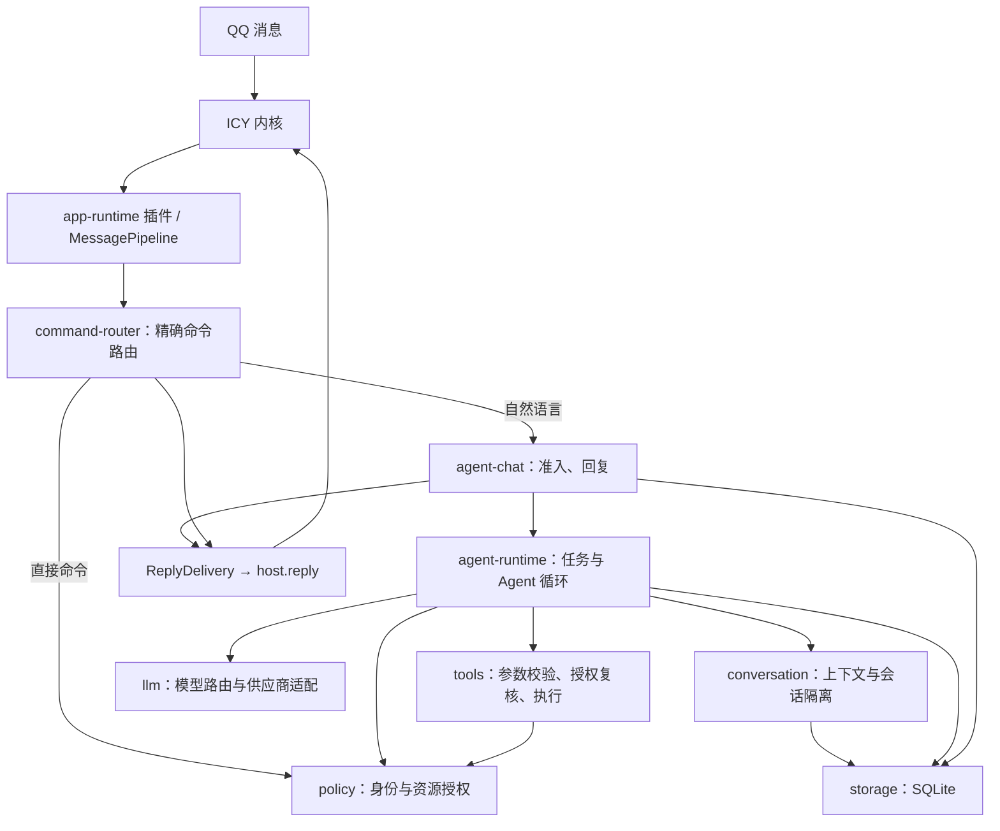
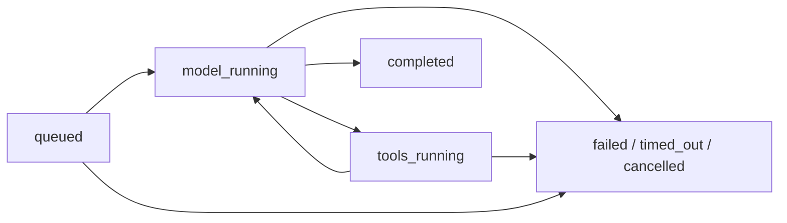

# ICY 下一阶段：LLM 与 Agent 应用设计

状态：实施中。A0 的模块配置与回复预算、A1 的模型接口和 Chat Completions 适配器已经落地；A2 的身份权限、直接命令、SQLite 会话与后台 Runs，以及 A3 的有界工具循环和执行点授权已接通。真实模型配置、精确费用预算、写操作审批、线上灰度与服务器部署尚未完成；Agent 默认关闭。

目标：在现有 QQ 接入与 App Runtime 之上，形成一个能连续对话、调用受控工具、取消任务、限制成本并记录执行结果的单 Agent 应用。本文不指定模型供应商、不包含凭证，也不改变当前服务器配置。

## 1. 范围与架构决策

第一版验收场景：用户在群里 @ 机器人或向它发送单聊消息；机器人结合该用户在当前会话中的历史，必要时调用只读工具，然后回复。任务可以查询状态或取消；进程重启后能保留历史和明确的中断记录。

采用一个 ICY 进程插件承载一个 Application，内部通过 App Module 提供能力。继续使用已有 app-runtime 作为入口；LLM、Agent、工具、会话均属于应用模块。内核继续负责 QQ 协议、消息窗口、发送频控和子进程监督；Runtime Core 继续只提供 Service、Event、Pipeline 机制。

第一版约束：单实例、单 Agent、文本输入输出、明确列出的只读工具。多 Agent、后台自主执行、任意 shell、任意文件访问、图片理解、向量检索和自动长期记忆另立阶段。模型与工具可以有应用依赖，依赖不得进入内核的运行时依赖清单。



Service 用于需要结果与错误归因的调用；Event 只用于指标、诊断通知等观察用途。任务推进、工具执行、状态持久化不依赖 EventBus listener 是否成功。

## 2. 模块划分与依赖

| App Module | 提供的 Service | 主要责任 | 直接依赖 |
|---|---|---|---|
| storage | AppStore | 数据迁移、事务、任务与消息持久化 | 无 |
| conversation | Conversations | 会话键、历史、上下文裁剪、清空与隔离 | storage |
| policy | Policy | 身份上下文、权限判定、资源范围、审计 | storage |
| command-router | 无，注册 middleware | 精确命令解析、直接调用业务 Service、同步回复 | core、policy、agent-runtime |
| llm | Models | 模型别名、能力检查、请求适配、流解析、用量 | 无 |
| tools | ToolRegistry / ToolExecutor | 工具描述、运行时参数校验、调用授权复核、输出上限 | policy |
| tools-basic | 无，自身注册工具 | 提供计算、时间、限定知识检索等实现 | tools |
| agent-runtime | Runs | 准入、队列、Agent 循环、预算、取消与恢复 | conversation、llm、tools、policy、storage |
| agent-chat | 无，注册 middleware | 自然语言消息到任务的映射、最终回复 | core、agent-runtime、policy、storage |

模块是可替换的责任边界，第一版可以放在同一应用包中，不要求逐个发布 npm 包。共享的业务 token、类型与错误枚举放在应用自己的 contracts 目录，不能加入 src/app/runtime/contracts.ts。

工具注册在所有模块 setup 期间完成，ToolRegistry 在 start 阶段冻结。每个 run 固定工具版本与 schema 快照，运行中不变更已有工具的含义。模块加载路径显式配置，沿用现有确定性装配方式。

## 3. LLM 接入契约

Models 对外使用模型别名，例如 chat-default。别名映射到明确的 provider、模型 ID、端点、能力和凭证引用。供应商与具体模型由后续部署配置决定；第一版只交付一个经过契约测试的适配器。

抽象契约：

| 操作/对象 | 必要字段与语义 |
|---|---|
| Models.describe(alias) | 上下文容量、输出上限、工具调用与流式能力；不支持的能力明确报错 |
| Models.generate(request) | modelAlias、messages、toolSchemas、outputLimit、deadline、AbortSignal |
| ModelTurn | text、toolCalls、finishReason、usage、requestId，以及适配器私有的续接状态 |
| ToolCall | callId、name、完整 JSON 参数；参数未收齐时不可执行 |
| ModelFailure | auth、rate_limited、timeout、unavailable、invalid_request、context_overflow、cancelled、invalid_output |

LLM 模块不读取 QQ event、不选择会话、不执行工具、不决定回复目标。Agent 使用同一轮请求结果中的 toolCalls 继续循环，不从自然语言里正则提取“工具命令”。

供应商适配器负责 HTTP/SDK、流式帧、错误码和调用 ID 转换。内部可以消费流式输出，但第一版向 QQ 发送完整最终结果。中途断流的工具参数不能当作完整调用执行。

不同接口的多轮续接状态不一定能仅靠文本重建。适配器可保存不透明续接数据，与 provider 和模型版本绑定；将它作为受限状态处理，不解析或记录为模型内部思维过程。应用审计只记录消息、工具请求、结果摘要与用量。

重试规则：可恢复的网络错误、限流或服务端失败最多重试一次，服从剩余时限；认证、请求参数和能力不支持立即失败。不能重跑已完成工具来补偿模型请求失败。自动切换模型仅允许在尚未产生工具副作用、且上下文与能力兼容时进行；第一版默认关闭切换。

配置区分公开参数与秘密：manifest 只保存别名和凭证引用，密钥来自应用专用的受限配置。凭证不得进入 prompt、工具参数、数据库正文或普通日志。进程内模块属于同一信任域，密钥引用接口不构成模块沙箱。

## 4. Agent 循环与任务状态

Run 是一次用户请求的执行单位；Step 是一次模型调用，或该模型调用产生的一次工具执行。Session 是多次 run 共享的对话上下文。



一次循环遵循以下顺序：

1. 原子登记 run，检查事件去重、身份、队列和预算，固定模型、工具与策略版本。
2. 获得 session 的执行权，读取已提交历史，生成本轮上下文。
3. 调用模型。返回工具调用时，先校验每个调用，再经 ToolExecutor 执行，按 callId 写入结果并继续下一轮。
4. 返回最终文本且没有待执行调用时，结束计算；在同一事务中保存会话轮次、run 结果和待发送回复。
5. ReplyDelivery 尝试发送；独立记录发送结果。

completed 只代表计算完成。回复送达状态单独记录为 pending、sending、sent、failed 或 unknown，不能把“模型完成”当成“用户已收到”。

一个模型轮次同时包含文本与工具调用时，文本作为过程输出保存，完成工具循环后才形成最终回复。最终文本为空、结构无效或反复重复相同失败调用时，以有界错误结束，不能无限循环。

第一版工具调用顺序执行，以便保持执行轨迹与取消语义明确。以后可以并行无副作用的独立工具，但同一 session 的 run 仍串行。

## 5. 消息调度与回复所有权

现有 Dispatcher 会等待同一 QQ 会话的 event/dispatch 完成。如果直接在 onEvent 中等待两分钟的 Agent 循环，同群的新消息和取消命令也会等待。

因此 agent-chat 只在入站路径完成短时准入和任务登记，随后让 Runs 在后台执行，通过 host.reply 发送结果。持久化登记成功才算接单；入站路径目标是在正常负载下 1 秒内返回。

但当前 IPC 的 null 表示继续尝试后续插件。第一版部署必须把 app-runtime 设为该类消息的唯一回复插件，停用 echo 和其他重叠回复插件；app 内被 Agent 接收的消息不再调用 next()。配置验收必须检查这条约束，不能只调 priority。

若后续要求多个回复插件共存，再增加通用投递结果：pass、reply、claimed。claimed 只表达当前插件承接后续回复，宿主记录 handle 所有者；这是通用宿主协议扩展，需要 SDK 与 IPC 版本协商，不引入 Agent 概念。该扩展不作为第一版多模块应用的前提。

command-router 与 agent-chat 是应用的两个消息入口：前者同步回复直接命令，后者投递 Agent 的最终回复。LLM、Agent 核心和工具没有 PluginHost，无法自行发送消息或选择接收者。最终接收会话由入站事件绑定，模型生成的字段不能覆盖它。

## 6. 会话隔离、队列与控制命令

默认会话键：

- 单聊：botId + userOpenid。
- 群聊：botId + groupOpenid + senderId。群中每位用户维护自己的上下文。
- 群共享上下文是以后显式开启的模式，不将私聊历史带入群聊；进入模型的每条群消息必须保留说话人身份。

同一 session 最多一个执行中 run；不同 session 可以并发。同一用户在不同会话的资源使用仍受用户总配额约束。

建议首版默认值（均为应用配置提案）：

| 限制 | 默认值 | 行为 |
|---|---|---|
| 全局并发 run | 4 | 超额进入有界队列 |
| 全局待执行队列 | 16 | 满时直接拒绝接单，返回繁忙 |
| 单 session 等待数 | 1 | 再有消息时提示当前任务未完成 |
| 最大排队时间 | 15 秒 | 超时移出队列并结束任务 |
| 单 run 总时长 | 自收到消息起 120 秒 | 排队、模型、工具、退避均计入 |
| 模型调用次数 | 6 次 | 含最后一次回答调用 |
| 工具调用次数 | 总计 8 次 | 循环预算耗尽时结束 |
| 单模型请求时限 | 最多 30 秒 | 不超过 run 剩余时限 |
| 单工具时限 | 最多 10 秒 | 允许工具声明更小值 |
| 模型输出 | 每次最多 2,000 token | 再受模型实际能力限制 |

这些默认值适用于当前单机验证阶段，真实容量以压测与模型延迟调整。若队列拥塞，新请求不能继续堆积到被动回复窗口以外。

command-router 在 agent-chat 前识别控制命令：/status 查看自己的任务、/cancel 取消自己的任务、/reset 清空自己的会话。控制命令不进 LLM，也不进入 Agent 执行队列。/reset 先取消活动任务，再更新会话 generation；旧 run 即使迟到，也不能写回新会话或发送旧结果。

## 7. 回复窗口、超时与取消

当前 PublicReplyHandle.expiresAt 不是最后允许提交时间：内核在剩余不足 minRemainingMs 时就拒绝，当前默认值是 60 秒。因此不能只拿 expiresAt 计算 Agent 时限。

建议先设计并交付一项通用契约补充：handle 增加 acceptBefore，表示内核承诺的最晚提交时刻。内核依据实际窗口和提前拒绝策略计算，SDK 原样保留；窗口计算还应扣除入站到登记期间的时间，不能让排队重新延长消息有效期。此字段属于通用消息预算，内核不需要了解 Agent。

Agent 的计算截止时间：min(入站时间 + 120 秒，acceptBefore - 15 秒发送预留)。排队前、出队时和每次模型/工具调用前都检查。窗口不足时不启动昂贵调用。第一版只使用带此字段的新宿主与 SDK 组合。

单个 run 默认只发送一次最终答复。长输出按配置的安全长度裁剪，说明已截断；不把 token 流逐条发到 QQ，不默认申请主动发送能力，也不在被动窗口失效后自动改用主动消息。

ReplyDelivery 保存待发送文本与提交状态。窗口失效后，用户可通过 /status 在新消息的有效 handle 下取回结果；它只能取回本人当前会话中授权的任务。

取消时，Runs 先提交取消状态，再触发专属 AbortController。模型网络请求、工具和等待队列均接收同一取消信号。迟到结果写回和发送前再次检查 run 的状态版本与 session generation；已经提交给 QQ 的回复无法保证撤销，已经发生的工具副作用也不宣称已回滚。

后台 run 不能继续使用 MessageDispatch 默认的永久有效 signal。Runs 必须主动管理每个任务的 controller；停机先禁止准入并取消任务，再有界等待，最后关闭存储。现有 Runtime 在 stop 钩子之后才释放 resources，因此 agent-runtime.stop 必须主动取消，不能仅等待模块 signal 被 abort。首版清理预算应小于宿主当前 5 秒 shutdown 窗口。

## 8. 工具系统与授权

工具定义包括：name、version、description、inputSchema、effect、timeout、maxOutputBytes、所需业务权限和 execute。effect 至少区分 read 与 write；参数验证发生在实际执行点，模型生成符合 schema 的 JSON 不代表获得授权。

执行上下文由程序提供：actor、sessionKey、runId、callId、deadline、signal、授权范围。工具参数不能自行声明调用者或扩张授权范围。

第一批工具建议：

| 工具 | 用途 | 边界 |
|---|---|---|
| clock_now | 当前时间与时区换算 | 不访问用户设备 |
| calculator_evaluate | 确定性计算 | 使用受限表达式解析，禁止 eval |
| knowledge_search | 查询配置好的小型知识集合 | 先做关键词检索；仅查询已授权集合 |

`knowledge_search` 仅在配置非空知识条目时注册。每个条目必须声明 `visibility: public`，或声明 `visibility: groups` 并列出 `groupOpenids`；执行时按当前 ActorContext 过滤。

工具返回结构化结果：成功数据或稳定错误、可读摘要、出处（适用时）、是否截断。单次结果初始上限 16 KiB，另外受上下文 token 预算控制。错误不能带 API key、完整本地路径或任意堆栈进入 prompt。

工具返回内容和检索材料视为数据，不获得系统指令地位。权限检查由程序执行，模型不能通过“忽略限制”之类文本更改允许的工具、目标或资源范围。

后续写工具需要独立审批状态：暂停运行，保存工具名、版本、规范化参数摘要、操作者、过期时间和一次性审批 ID；收到该用户的新消息后恢复。审批绑定精确参数，参数变化重新审批。恢复用新 handle，不依赖原来的被动窗口。确认由程序核对，模型输出“用户已同意”无效。

审批是应用业务权限机制。进程内工具仍属于可信代码；未来接入不可信执行器时，以独立进程或隔离环境承载，审批本身不提供沙箱。

## 9. 存储、历史与故障恢复

第一版使用单机 SQLite，以便原子更新会话、run 和发送记录。具体驱动在实现时按服务器 Node 版本与依赖策略确认，业务模块不依赖驱动 API。建议数据位置为 /var/lib/icy/agent，独立于版本发布目录。

逻辑数据集合：

| 集合 | 关键内容 |
|---|---|
| sessions | 会话所有者、隔离键、generation、上下文策略版本 |
| messages | 角色、内容、来源 run、发送状态、创建时间 |
| runs | 输入事件键、状态与版本、预算、deadline、模型与策略版本 |
| steps | 顺序、模型调用、工具 callId、耗时、结果或稳定错误 |
| deliveries | run、回复摘要、状态、平台 messageId、失败原因 |
| usage | run 和用户维度的 token、调用数、估算费用 |

入站幂等键包含 botId、事件类型、会话标识与 messageId，不单靠短期内存去重。同一个键只创建一个 run。保留去重记录的期限与聊天正文期限分开，避免清空聊天后立即失去重放保护。

上下文初版使用近期已提交轮次和硬性 token 预算；不默认生成长期用户画像。裁剪必须保留完整的工具调用与对应结果，不能留下孤立的 tool message。历史是用户表达与回复记录，失败、中断和未送达答案需标识，不能默认为成功对话。

建议聊天正文默认保留 7 天、任务与用量元数据 30 天，可配置；清空命令与到期清理覆盖正文、工具原始结果和 provider 续接数据。数据库、备份和日志分别执行保留策略，不能只删数据库却无限保留日志副本。

重启时：未执行的 queued 与执行中的 run 标记 interrupted；第一版不自动重新调用模型或工具。用户通过 /status 得知中断，再明确重试生成新 run。旧进程的 handle 不再可用。

对于“QQ 接受了消息，但本地尚未记录成功就崩溃”的情况，delivery 标记 unknown，不自动再次发送。平台缺少可核实的幂等或查询能力时，不承诺 exactly-once 发送。将来写工具也需要同样处理“已执行但回执丢失”的不确定状态。

## 10. 成本与可观测性

预算覆盖单请求、单 run、用户日额度和全局日额度。开始调用前预留输入估算与最大输出配额；结束后按 provider usage 结算。缺失 usage 时按保守预留计费，不能当成零。输入估算要留余量，以 provider 与模型的计量方式为准。

费用是依据配置价格计算的估算，不能当作供应商账单。日额度在准入阶段原子预留；用户不能通过并发请求跨过额度。模型切换后重新校验价格与上下文预算。

默认记录 runId、session 匿名标识、状态、模型别名、步骤数、工具名、耗时、token 用量、发送结果和错误类别。完整 prompt、用户原文、工具原始结果不进入普通生产日志，也不存储模型内部思维过程。

关注指标：接单成功率、排队时间、模型/工具延迟、取消生效时间、超时原因、发送失败率、unknown delivery 数量与 token 用量。EventBus 观察者失败可以被记录，但不会决定 run 是否提交成功。

## 11. 对当前项目的必要衔接

1. app-runtime 的 config.modules 支持旧路径字符串与 { path, config } 描述，供不同业务模块接收各自配置。秘密仍使用引用，不写入模块配置正文。
2. app-runtime 部署为对应 QQ 消息的唯一回复插件，停用示例 echo；示例模块按需保留，避免把 count/ping 验证行为混入正式 Agent 会话。
3. 宿主与 SDK 设计 acceptBefore 的统一来源与兼容策略；Agent 不复制内核的提前拒绝常量。
4. 应用任务使用明确的 AbortController 与停机顺序；后台任务登记、查询、取消全部由 Runs 持有。
5. 部署时配置应用数据目录、模型凭证、工具允许清单与成本上限；保持内核 QQ AppSecret 与应用模型密钥的用途分离。

衔接项按 A0–A4 分阶段实施。A0 已实现模块级配置入口、回复预算契约与入站请求停机取消；A1 已增加模型服务契约和 Chat Completions 适配器，使用内置 fetch。A2/A3 现已接入 Policy、command-router、SQLite Runs、后台 Agent 循环与受权工具；原同步单轮入口已改为后台任务准入。模型函数名使用服务商允许的下划线形式。部署时仍需确保 app-runtime 是对应 QQ 消息的唯一回复插件。本阶段未改动服务器部署。

模型模块配置示例：

```json
{
  "path": "../../dist/modules/llm/module.js",
  "config": {
    "models": [
      {
        "alias": "chat-default",
        "model": "provider-model-id",
        "baseUrl": "https://provider.example/v1",
        "apiKeyEnv": "ICY_LLM_API_KEY",
        "contextTokens": 32000,
        "maxOutputTokens": 2000,
        "outputTokenParameter": "max_completion_tokens",
        "supportsTools": true,
        "timeoutMs": 30000
      }
    ]
  }
}
```

`apiKeyEnv` 只保存环境变量名，实际密钥需由部署环境提供。适配器使用 [Chat Completions](https://developers.openai.com/api/reference/resources/chat/subresources/completions/methods/create) 的消息、工具调用和用量格式；部分兼容端点采用 `max_tokens` 时可通过 `outputTokenParameter` 显式指定。当前未配置模型别名与密钥；`runs.enabled` 和 `agent-chat.enabled` 均为 `false`，不会向外发模型请求。启用时须同时配置模型别名、凭证、持久化 SQLite 路径、额度与这两个开关。

## 12. 开发顺序与验收门槛

| 阶段 | 交付 | 完成条件 |
|---|---|---|
| A0 应用衔接 | 模块配置、唯一回复入口、回复预算、停机取消契约 | echo 不抢答；取消命令不被长任务阻塞；排队不延长回复预算 |
| A1 LLM 基础 | 一个真实 provider 适配器、文本单轮回复 | 固定假适配器与真实接口都能验证成功、认证失败、限流、超时和取消；记录用量 |
| A2 会话与任务 | SQLite、隔离键、准入队列、Policy、command-router、/status /cancel /reset | 同 session 串行、跨 session 并行；直接命令不调用模型；重启保留历史且任务明确中断；迟到结果不能污染 reset 后会话 |
| A3 Agent v1 | 有界循环、工具注册与执行、三个只读工具、工具权限复核 | 跑通模型→工具→模型→最终回复；未授权工具不暴露且无法伪造调用；未知工具、非法参数、循环超限、断流工具参数均正确拒绝 |
| A4 灰度上线 | 回放评估、限额、回复状态、运维指标 | 真实 QQ 完成收发；窗口到期可取回结果；重复事件不重复运行；达到并发上限时稳定拒绝 |

每个阶段先用可重放的假模型输出固定控制流，再用真实 provider 验证适配与效果。确定性指标包括工具选择及授权、取消、幂等和状态迁移；答案质量另用固定样本人工评估，不能仅凭自然语言回复相似度验收。

首版可上线门槛是 A0–A4 全部通过。以后按真实需求分别设计：需审批的写工具、异步长任务、多模态、检索增强、跨会话记忆、多 Agent；这些能力各自带来新的权限、存储与交付语义，不捆绑进入首版。

## 13. 实施前的产品配置项

设计默认使用“群内每用户隔离会话、群 @ 与单聊触发、120 秒预算、只读工具、7 天正文保留”。实现前需要确定首个 provider/模型、明确的用户与全局日费用上限，以及知识库内容范围。未提供模型凭证或允许额度时，应用应保持未启用状态并给出可诊断配置错误。

设计验收示例：用户问一个需要查询知识的事实 → Agent 调用 knowledge.search → 根据结果作答并标注出处；随后询问“刚才那个结论有什么限制”时正确关联同一用户的会话。其他群成员的上下文不混入；/cancel 与 /reset 始终走确定性的应用逻辑。

## 14. 用户权限、直接命令与 Agent 工具的统一边界

### 身份与权限

入站消息先生成只读 ActorContext：botId、场景（群或单聊）、senderId、groupOpenid（群聊时）、eventId 和身份来源。目标身份分别取群消息的 member_openid、单聊消息的 user_openid；两类 OpenID 不假定可合并。当前 normalize 在这些字段缺失时会回退 author.id，因此实现权限上下文时需显式保留身份来源；回退值未经确认不能获得用户或群资源授权。缺少可信身份或群标识时拒绝对应操作，不使用 `unknown` 拼出共享授权键。昵称和模型输出不能充当身份。QQ 入站的 senderRole 可用于低风险的群角色映射；高影响操作要使用显式授权或重新核验角色，角色缺失时不得推定管理员权限。

Policy 的输入为 `(actor, action, resource)`，返回 allow、deny 或 approval_required 及稳定原因。resource 包含类型、所有者和所属群，不由模型自行指定授权范围。默认拒绝，显式授予普通用户可用的能力；用户拥有的 run/session 必须检查所有者；群知识库按群授权。角色映射是配置，配额与频控是另一层准入限制，不能把“费用额度充足”当作业务权限。

首版建议的能力矩阵：

| 操作 | 允许范围 | 入口 |
|---|---|---|
| agent.use | 已启用的群 @ 与单聊用户，受配额限制 | 自然语言 |
| runs.read、runs.cancel、sessions.reset | 本人且当前会话的资源 | /status、/cancel、/reset |
| tools.clock、tools.calculator | 已准入的 Agent 用户 | Agent 工具 |
| knowledge.read | 该用户有权访问的知识集合及群范围 | Agent 工具 |
| group.settings.write | 仅显式授权的群管理者；后续加入审批 | 直接命令或写工具 |

### 消息路由

在命令路由之前先做平台事件类型、机器人自身消息、可信身份、群唤醒条件和会话启用状态检查。命令分类之后再应用各自的限流：`/cancel`、`/status`、`/reset` 不占用 Agent 队列或模型费用额度，仍受身份授权和轻量防滥用限制；普通文本进入 Agent 准入、成本预留和有界队列。这样长模型调用与额度耗尽不会阻断取消。

`command-router` 以比当前 `agent-chat` 更早的 middleware priority 注册，例如 -200（当前 agent-chat 为 -100）。它只识别明确的 `/name` 命令和该命令自己的参数语法；`/status`、`/cancel`、`/reset` 先通过 Policy，再直接调用 Runs/Conversations 等业务 Service 返回结果，绝不调用 Models。`/help` 只列出当前用户有权使用的命令。未知或无权的斜杠命令给确定性回复，不调用 `next()` 使它落入 Agent。若提供 `/ask 文本`，它是显式转交 Agent 的例外，也要经过 `agent.use` 准入。

普通文本由 agent-chat 完成短时身份、权限、配额与去重检查，向 Runs 登记后台任务后尽快退出消息处理路径。Runs 使用登记时绑定的 ActorContext 构造 AgentRequest；模型只收到与该身份、群、会话相符的可用工具 schema。Agent 不把模型生成的 senderId、groupOpenid、runId 或会话键当作可信输入。

直接命令和 Agent 工具应调用相同的业务 Service。例如查询运行状态由 Runs.status(actor, runId) 实现，命令只负责解析与展示；若以后添加等价工具，它调用同一方法。`/cancel` 与 `/reset` 保持直接命令，因为它们必须在现有 run 正在等待模型时仍可执行。Command Router 返回 `null` 时仅代表 App 内已处理；宿主仍可能尝试下一个插件，因此上线前必须落实第 5 节的唯一回复插件约束。

### 工具执行点复核

ToolDefinition 增加 requiredAction、resourceResolver 和 effect。ToolExecutor 先校验完整参数，再从程序绑定的 ActorContext 与经过约束的参数解析实际资源，紧接执行前调用 Policy。权限在 Agent 提供 schema 时检查一次，在工具执行点再检查一次；中途撤销授权时执行点以最新策略为准。未授权工具不暴露给模型，模型仍可能伪造调用，因此 ToolExecutor 对所有调用强制复核。授权失败返回稳定的拒绝结果，不泄露其他用户资源是否存在。

只读工具先上线。写工具要在业务授权之外增加独立审批：审批绑定用户、工具名与版本、规范化参数、资源、有效期和一次性 ID；模型自称“用户同意”不能替代审批。执行前再次校验业务授权、审批、run 状态和 deadline。命令与工具的授权结果、拒绝原因、runId/callId 写入审计记录；不记录提示词、密钥或完整工具结果。

验收时用假模型与假工具证明：直接命令的 Models 调用数为零；未授权命令被拒绝且不流入 Agent；未授权工具既不在 schema 中，也无法通过伪造 tool call 执行；入队后撤销权限会在执行点阻断；不同群与单聊之间的资源不可串用；模型请求未完成时 `/cancel` 仍能生效。

## 15. AstrBot Agent 流程的参考与取舍

参考的是 AstrBot 官方文档与源码所表达的能力边界，而非复制其 Python 模块结构。其 [管道顺序](https://github.com/AstrBotDevs/AstrBot/blob/master/astrbot/core/pipeline/stage_order.py)包含唤醒、白名单、会话启用、限流、预处理、插件或 LLM 处理、结果装饰与发送；[命令处理](https://docs.astrbot.app/dev/star/guides/listen-message-event.html)支持在命令处理后停止事件传播，阻止后续 LLM 请求；[Agent Runner 接口](https://github.com/AstrBotDevs/AstrBot/wiki/en-dev-star-guides-ai)封装模型与工具循环，并提供步数和工具超时上限。

| AstrBot 中可借鉴的机制 | ICY 中的落点 |
|---|---|
| 消息管道先做唤醒、允许范围和会话检查 | 在 app-runtime 内建立短时准入流程；维持内核只负责 QQ 协议和插件监督的边界 |
| 命令独立于 LLM，处理后停止传播 | command-router 先于 agent-chat；命令成功、失败和未知命令均有确定性归属 |
| Agent Runner 与 Provider、工具集分离 | 保留纯 BoundedAgentEngine；由 Runs 持有会话、预算、取消、投递，Models 仅负责供应商适配 |
| 可配置工具集与人格可用范围 | 工具启用配置、场景配置、用户权限三层相交形成本 run 的工具 schema；执行点仍由 Policy 复核 |
| Agent 开始、工具调用前后、完成等[生命周期钩子](https://docs.astrbot.app/dev/star/guides/listen-message-event.html) | 用有类型的观察事件记录指标与审计；授权、任务状态和投递不依赖钩子是否成功 |
| 按会话隔离以及 [停止、重置命令](https://docs.astrbot.app/use/command.html) | 群内每用户独立 session；控制命令在 Runs 队列外处理，且清空历史时以 generation 阻断旧结果 |
| 管道末端装饰与发送 | 统一 ReplyDelivery 处理长度、平台格式、有效窗口和发送状态；QQ 首版不逐 token 推送 |

AstrBot 的[函数工具管理](https://docs.astrbot.app/use/function-calling.html)支持按配置启用工具。ICY 首版仍使用显式注册和只读工具名单；配置决定哪些工具可考虑，ActorContext 与资源权限决定当前请求能否看到及执行。AstrBot 对本机电脑能力增加管理员或沙盒边界的做法，也说明以后接入 Shell、Python、文件工具时需要独立执行环境，不能仅把它们作为普通进程内工具加入注册表；参考其[电脑能力说明](https://docs.astrbot.app/use/computer.html)。

## 16. 当前实现与启用条件

本阶段已经实现以下应用边界：

| 模块 | 当前行为 |
|---|---|
| identity / policy | 只接受明确的群 member_openid 或单聊 user_openid；按 bot、场景、群与用户组成会话键；拦截被禁用户、群及工具 |
| command-router | `/help`、`/status`、`/cancel`、`/reset`、`/calc`、`/time` 走确定性逻辑；未知斜杠命令也不会流入模型 |
| agent-chat / runs | 普通文本快速登记后台任务；同会话串行、不同会话有界并行；SQLite 保存历史、任务和回复状态；支持取消、重置、去重和重启中断标记 |
| Agent / Tools | 按当前身份筛选模型可见工具；模型发起工具调用时再次检查权限，限制调用数、时限、参数和输出大小 |

Runs 默认使用内存 SQLite 且 Agent 入口拒绝在这种模式下启用。正式配置需提供持久路径，例如：

```json
{
  "path": "../../dist/modules/agent-runtime/runs.js",
  "config": {
    "enabled": true,
    "dbPath": "/var/lib/icy/agent/state.sqlite",
    "modelAlias": "chat-default",
    "outputLimit": 2000,
    "maxRunsPerSession24h": 20,
    "maxRunsGlobal24h": 200
  }
}
```

同时将 `agent-chat.enabled` 设为 `true`，并为 Models 配置已验证的模型与 `apiKeyEnv` 指向的环境变量。Policy 默认拒绝所有群和单聊；上线时显式设置 `policy.allowedGroups` 为允许的群 OpenID 列表，或设置 `policy.allowC2c=true` 开放单聊。app-runtime 的启动参数包含 `--experimental-sqlite`，兼容仍需该开关的 Node 22 版本。当前近 24 小时额度按会话和全局计数；QQ 的群 member_openid 与单聊 user_openid 不能可靠合并成跨场景用户额度。

验证脚本 `npm run agent-flow-smoke` 使用假模型和临时 SQLite，覆盖直接命令零模型调用、命令与 Agent 共用计算工具、未授权工具伪造、群权限、取消、重置、回复失败后查询、重启恢复和中断标记。尚待补充真实供应商验收、精确 token/费用预留与结算、运行步骤审计、回复插件唯一性部署检查、写工具审批及灰度上线。
